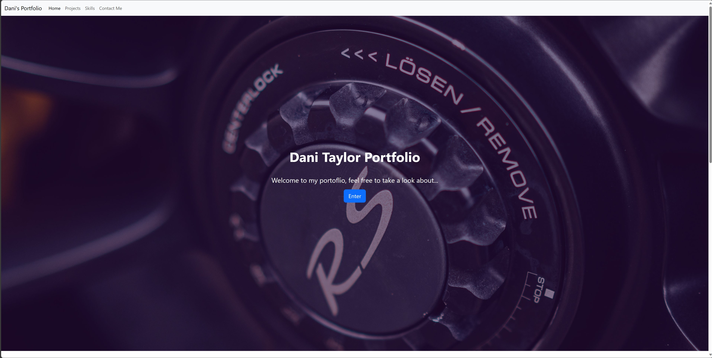
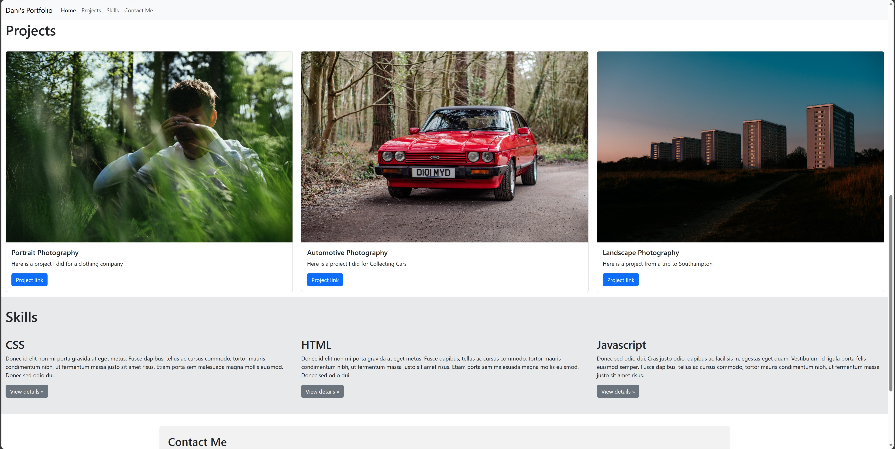

# Bootstrap-Portfolio

## Description

Bootstrap portfolio website built to meet accessiblity crieta. I have addded my own images and text and decided to use a sticky nav bar, this is a one page portfolio which looks quite slick.

## Installation

You can pull this repo or you can view on [github pages](https://dani57t.github.io/Bootstrap-Portfolio/)

## Usage

Website uses simple bootstrap elements

## Credits

I followed tutorials on [w3 docs](https://www.w3docs.com/)

## License

MIT

Dani Taylor 2023
